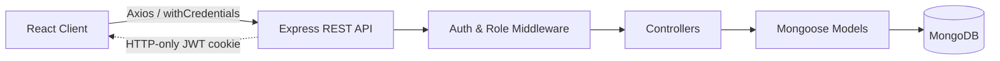
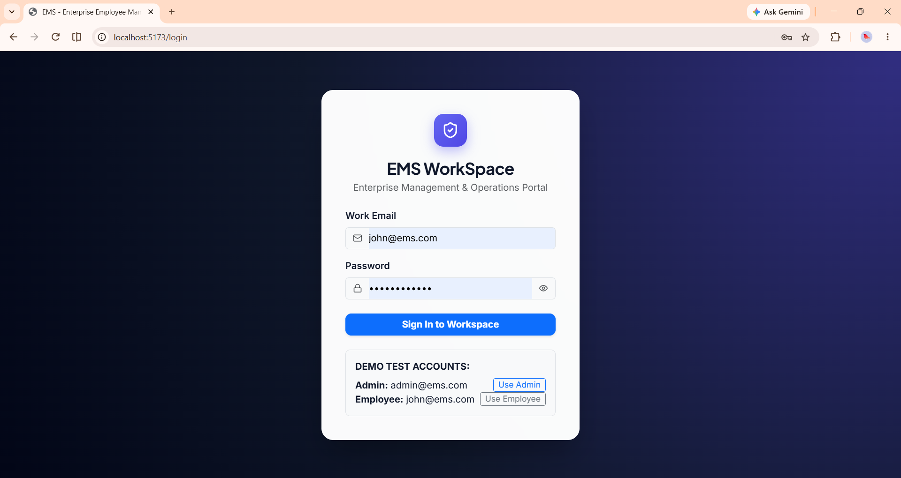
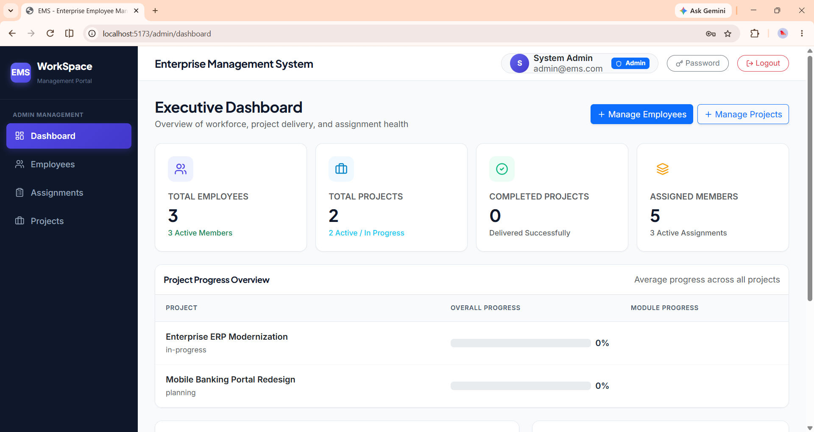
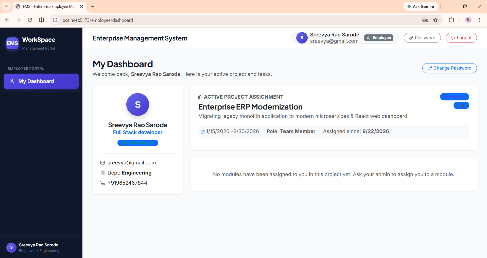
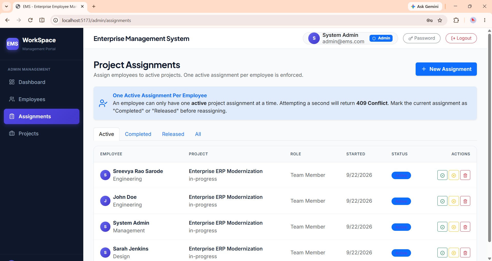

# EMS WorkSpace — Employee Management System

**A role-based MERN-stack platform for managing employees, projects, modules, and task-level progress.**

Built as a full-stack student project demonstrating REST API design, JWT authentication, role-based authorization, and data-driven progress tracking on the MERN stack (MongoDB, Express, React, Node.js).

---

## Overview

EMS WorkSpace lets an administrator manage a workforce and its project portfolio end-to-end: create employees, create projects, assign employees to projects (with a strictly enforced one-active-project-per-employee rule), break each project into modules, assign one employee per module, and define tasks within each module. Employees log in to a focused personal dashboard where they see only their own project, their own modules, and their own tasks — and mark tasks complete as work finishes. Progress at every level (module and project) is *computed* from actual task completion, never manually entered.

## Key Features

**Admin**
- Full employee directory — create, edit, deactivate, search, and filter by department/status
- Project portfolio management — create/edit/delete projects with budget, priority, timeline, and client tracking
- Project assignment engine enforcing one active assignment per employee, with Active / Completed / Released assignment states
- Embedded module & task management per project, each module assigned to exactly one employee
- Executive dashboard — workforce totals, project status breakdown, and computed progress per project

**Employee**
- Personal dashboard showing their active project, assigned modules, and tasks
- One-click task completion, restricted to tasks in modules they own
- Live progress bars computed from completed vs. total tasks — no manual entry
- Self-service password change

**Platform-wide**
- JWT authentication delivered via HTTP-only cookies (never exposed to frontend JS)
- bcrypt-hashed passwords, excluded from every API response
- Role-based route protection (admin-only vs. authenticated-only) enforced server-side, not just hidden in the UI

## Tech Stack

| Layer | Technology |
|---|---|
| Frontend | React + Vite |
| Routing | React Router |
| HTTP Client | Axios |
| UI | React Bootstrap |
| Backend | Node.js + Express.js |
| Database | MongoDB + Mongoose |
| Auth | JWT + HTTP-only cookies |
| Password Security | bcrypt / bcryptjs |

## Architecture



**Request flow:** React Component → Axios call → Express Route → Auth/Role Middleware → Controller → Mongoose Model → MongoDB, with a consistent `{ success, message, data }` response shape and centralized error handling throughout.

## Core Business Rules

- An employee can hold only **one active project assignment** at a time — enforced server-side.
- A project can have multiple employees; a project can contain multiple modules.
- Each module is assigned to **exactly one** employee.
- A module can contain multiple tasks; only the module's assigned employee can complete its tasks.
- Module progress = `(completed tasks / total tasks) × 100` — always computed, never stored as a raw number.
- Project progress rolls up from the completion state of all its modules/tasks.
- Modules and tasks are **embedded** inside the Project document (not separate collections).

## Project Structure

```
ems-project/
├── server/
│   └── src/
│       ├── config/        # DB connection, env loading
│       ├── models/        # Employee, Project (with embedded Modules/Tasks), Assignment
│       ├── controllers/   # auth, employee, project, assignment, dashboard
│       ├── routes/        # REST route definitions
│       ├── middleware/    # auth, role, error handling
│       └── utils/         # response helpers, status/message constants
└── client/
    └── src/
        ├── api/           # axios instance + endpoint functions
        ├── components/    # shared UI (modals, sidebar, etc.)
        ├── pages/
        │   ├── admin/     # Dashboard, Employees, Projects, Assignments
        │   └── employee/  # Employee Dashboard
        ├── context/       # AuthContext
        └── routes/        # ProtectedRoute, AdminRoute
```

## Getting Started

### Prerequisites
- Node.js and npm
- MongoDB running locally, or a MongoDB Atlas connection string

### 1. Clone and install

```bash
git clone <your-repo-url>
cd ems-project

cd server && npm install
cd ../client && npm install
```

### 2. Configure environment variables

Create `server/.env` from `server/.env.example`:

| Variable | Description |
|---|---|
| `MONGO_URI` | MongoDB connection string |
| `JWT_SECRET` | Secret used to sign JWTs |
| `PORT` | Port the API listens on |
| `CLIENT_URL` | Frontend origin, for CORS (e.g. `http://localhost:5173`) |

### 3. Seed initial data

```bash
cd server
npm run seed
```

This creates the initial admin account (see Demo Accounts below).

### 4. Run the app

In two separate terminals:

```bash
# Terminal 1 — backend
cd server
npm run dev

# Terminal 2 — frontend
cd client
npm run dev
```

Visit `http://localhost:5173`.

## Demo Accounts

| Role | Email | Notes |
|---|---|---|
| Admin | `admin@ems.com` | Full administrative access |
| Employee | `john@ems.com` | Standard employee view |

*(Passwords set via the seed script — update this table with your actual demo credentials before submission, and never commit real production credentials.)*

## API Overview

| Module | Method | Endpoint | Access |
|---|---|---|---|
| Auth | POST | `/auth/login` | Public |
| Auth | POST | `/auth/logout` | Authenticated |
| Auth | GET | `/auth/profile` | Authenticated |
| Employees | POST/GET/PUT/DELETE | `/employees`, `/employees/:id` | Admin |
| Projects | POST/GET/PUT/DELETE | `/projects`, `/projects/:id` | Admin (write) / Authenticated (read) |
| Assignments | POST | `/assignments` | Admin |
| Assignments | GET | `/assignments/employee/:employeeId` | Admin / Owner |
| Assignments | PUT | `/assignments/:id/complete` | Admin |
| Tasks | PUT | `/projects/:projectId/modules/:moduleId/tasks/:taskId/complete` | Assigned Employee |

## Screenshots


```markdown




```
<div align="center">


</div>    
<div align="center">


</div>    


## Testing

Manually verified scenarios include: duplicate employee email rejection, second active-assignment rejection (409), cross-employee task completion rejection, and unauthorized access to admin-only routes. See `/docs/postman_collection.json` for the full API test collection *(add this if you've exported one)*.

## Author

**Sarode Sreevya Rao**


Built as a MERN-stack student project demonstrating full-stack architecture, role-based authorization, and progress-tracking design.
